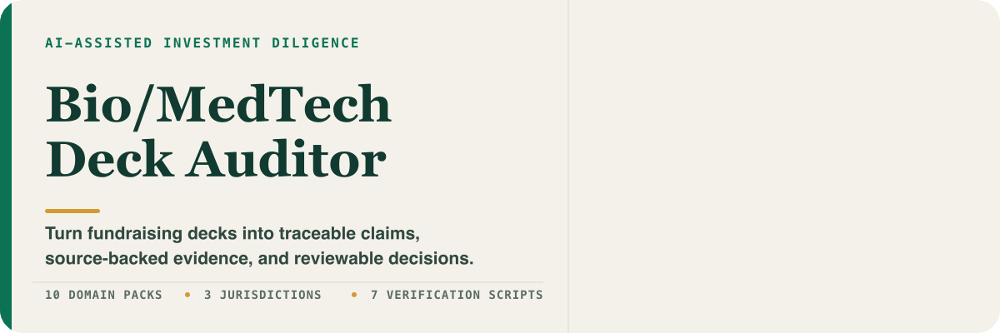
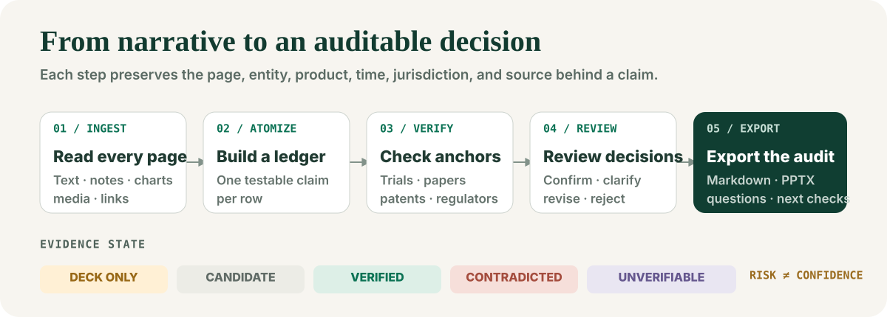
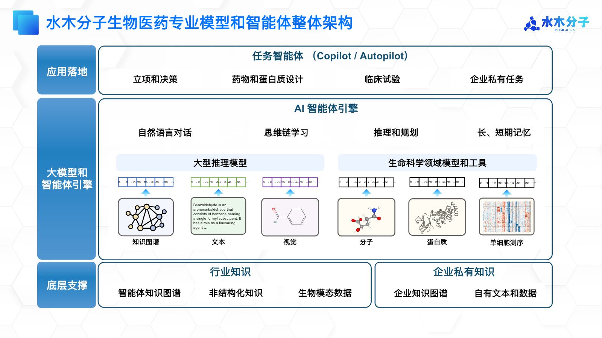
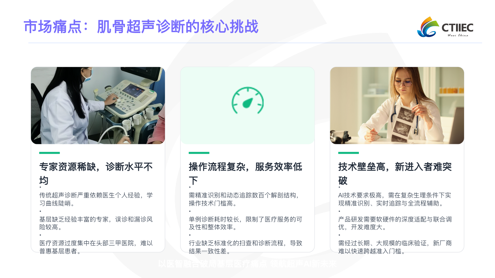
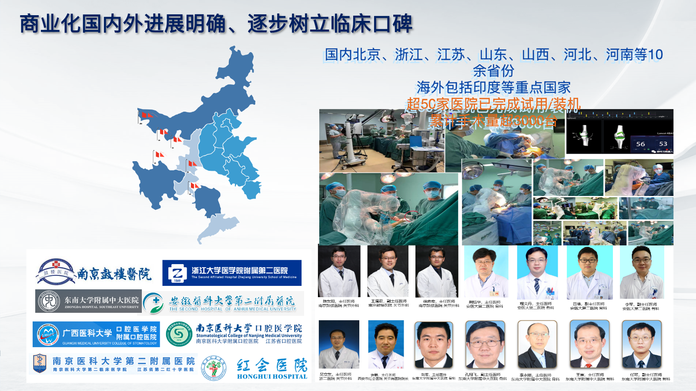

<p align="center">
  
</p>

<p align="center">
  <a href="#quick-start">Quick start</a> ·
  <a href="./bioai-deck-auditor/">Audit skill</a> ·
  <a href="./deck-audit-workbench/">Review workbench</a> ·
  <a href="./outputs/">Sample reports</a>
</p>

Bio/MedTech Deck Auditor is an evidence-calibrated diligence workflow for biotech, therapeutics, medical devices, healthcare AI, BCI, and health SaaS fundraising materials. It turns a deck into atomic, testable claims and evaluates them across technology, clinical/regulatory, commercial, team/governance, and capital.

> [!IMPORTANT]
> The core rule is simple: keep **what the deck claims**, **what external evidence supports**, and **what the analyst concludes** visibly separate. This project supports investment screening; it is not investment, legal, medical, or regulatory advice.

## From narrative to an audit trail

<p align="center">
  
</p>

The workflow starts with a claim ledger—not an opinion. Every material claim keeps its slide, original wording, legal entity, product or version, time attribute, jurisdiction, evidence type, and review status. Only then does the system form a judgment in a fixed shape:

```text
evidence → reasoning → impact → disconfirming condition → next verification step
```

Evidence status and risk severity are deliberately independent. A high-impact red flag can have low confidence; missing information remains a verification item unless the omission itself violates a disclosure, regulatory, or stage-specific expectation.

## Real materials, reviewable outputs

<p align="center">
  
  
  
</p>

The repository includes three end-to-end screening examples and a blind-test retrospective:

| Case | Markdown report | PPTX report |
| --- | --- | --- |
| Lancet Robotics | [Read the report](./outputs/reports/lancet-robotics-initial-screening.md) | [Download](./outputs/reports/lancet-robotics-initial-screening.pptx) |
| Shimei | [Read the report](./outputs/reports/shimei-initial-screening.md) | [Download](./outputs/reports/shimei-initial-screening.pptx) |
| Shuimu Molecular | [Read the report](./outputs/reports/shuimu-molecular-initial-screening.md) | [Download](./outputs/reports/shuimu-molecular-initial-screening.pptx) |

[Read the three-deck blind-test retrospective →](./outputs/three-deck-blind-audit-2026-07-17.md)

## What is in the repository

| Path | Purpose | Status |
| --- | --- | --- |
| [`bioai-deck-auditor/`](./bioai-deck-auditor/) | Seven-step agent skill with 10 domain packs, three jurisdiction guides, 41 reference files, and seven verification scripts | Usable |
| [`deck-audit-workbench/`](./deck-audit-workbench/) | Human review surface: upload a deck, review claims, inspect evidence, record decisions, and export Markdown/PPTX | Runnable prototype; not deployed |
| [`outputs/`](./outputs/) | Three screening reports plus one blind-test retrospective | Sample evidence |

## What the auditor checks

- **Technology and science** — study design, benchmarks, external validation, failure modes, reproducibility, and the path from model performance to real-world value.
- **Clinical, regulatory, and data** — intended use, product/version boundaries, trial and registration anchors, privacy, quality systems, complaints, recalls, and post-market evidence.
- **Commercial quality** — separates leads, research collaborations, pilots, contracts, installation, acceptance, payment, active use, and renewal instead of merging them into one “customer” count.
- **Team and governance** — key-person commitment, capability gaps, IP ownership, technology transfer, related parties, cap table, runway, and milestone alignment.
- **Capital and transaction** — financing evidence, valuation definitions, comparable-company dates and currencies, dilution, working capital, exit constraints, and return assumptions.

For multi-product companies, the auditor builds a legal-entity → SKU → version → certificate → intended-use → manufacturer → revenue matrix. A certificate verifies only the matching cell; it does not automatically cover adjacent products, indications, modules, or related companies.

## Automation boundary

| Check | Tooling | Boundary |
| --- | --- | --- |
| PDF/PPTX text, notes, cached chart values, links, and embedded-media inventory | `extract_deck.py` | Machine extraction never replaces page-by-page visual review |
| Cross-slide arithmetic | `cross_check_numbers.py` | Deterministic when the inputs are structured |
| Papers and citations | `verify_refs.py` | Uses public APIs; title matches remain candidates until identity fields align |
| Clinical trials | `verify_trials.py` | ClinicalTrials.gov is API-backed; ChiCTR may require manual fallback |
| Patents | `verify_patents.py` | Produces candidates for analyst confirmation |
| Chinese regulatory leads | `cn_reg_sources/` | Used only within each source adapter's stated capability |

Valuation output is data-dependent: full rNPV when stage probabilities and conditional cash flows are defensible; scenario ranges when probabilities are sparse; implied-milestone analysis when the deck does not support a numeric valuation.

## Quick start

### Install the agent skill

```bash
npx skills add https://github.com/shenjiayi692-maker/bio-deck-auditor \
  --skill bioai-deck-auditor
```

Then invoke it with a deck attached:

```text
Use $bioai-deck-auditor to audit this deck claim by claim and produce an evidence-calibrated investment screening report.
```

### Run deterministic deck extraction

```bash
git clone https://github.com/shenjiayi692-maker/bio-deck-auditor.git
cd bio-deck-auditor/bioai-deck-auditor/scripts

python3 -m venv .venv
source .venv/bin/activate
pip install -r requirements.txt

python extract_deck.py /path/to/deck.pptx -o extracted-deck.json
python validate_claims.py /path/to/claim-ledger.json
python cross_check_numbers.py /path/to/number-checks.json
```

### Run the review workbench

The workbench requires Node.js `>=22.13.0`, the project-declared local D1/R2 bindings, and an OpenAI API key.

```bash
cd deck-audit-workbench
npm install
cp .dev.vars.example .dev.vars
npm run dev
```

For production, provide `OPENAI_API_KEY` through the hosting platform's environment settings. Do not commit it to the repository.

## Current limitations

This is an analyst-copilot prototype, not an autonomous investment committee. Claim extraction, arithmetic checks, source calibration, and founder-question generation are the strongest parts today. The entity/asset boundary, product-version-certificate mapping, chart forensics, commercialization funnel, manufacturing and post-market quality, live market data, capital-return modeling, multi-user review, authentication, quotas, retries, and continuous regression evaluation still need further productization.

The workbench currently has no authentication, quota controls, or collaborative conflict handling. Anyone with its URL could upload and review files, so do not expose an unconfigured deployment to sensitive materials.

## Development

Run the verification suite:

```bash
cd bioai-deck-auditor/scripts
python3 -m unittest discover -s tests -p 'test_*.py'

cd ../../deck-audit-workbench
npm test
npm run lint
```

The workbench uses Next.js 16 on Cloudflare Workers via vinext, D1 + Drizzle for structured state, R2 for source decks and generated reports, the OpenAI Responses API for structured analysis, and `pptxgenjs` for compact PPTX exports.

## Source-material note

The reports in `outputs/` are independent analyses by the repository author. The three source-slide images shown above come from the analyzed companies' original materials and are included only to demonstrate the review workflow; their copyrights remain with their respective owners.

## License

[MIT](./LICENSE). Referenced regulations, third-party sources, and source-deck materials remain the property of their respective rights holders.
